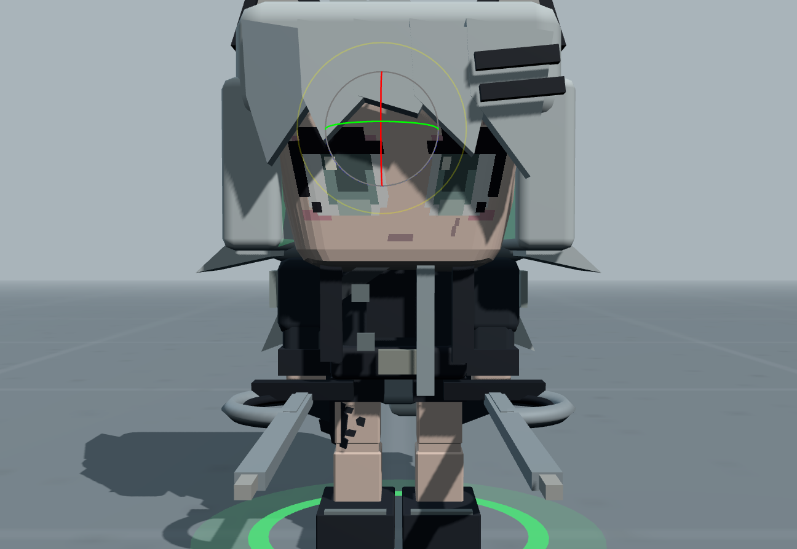
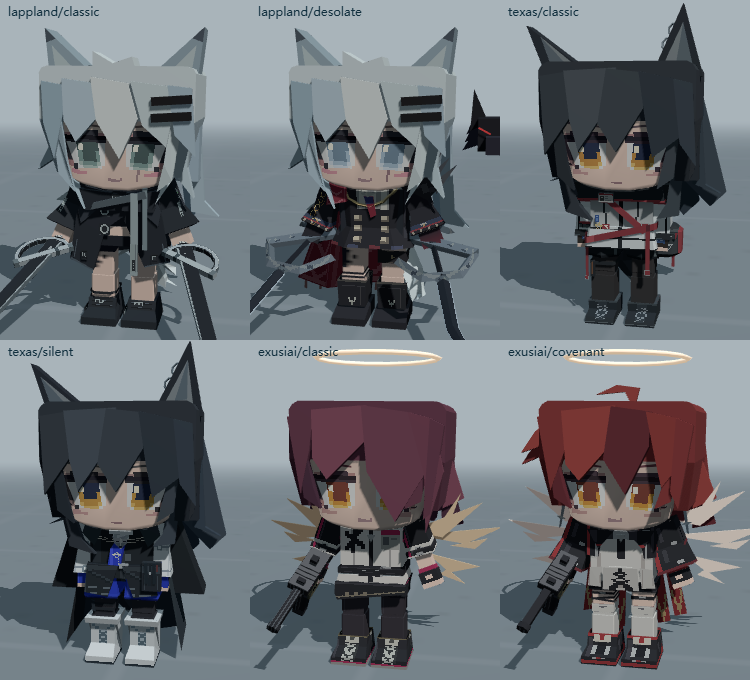
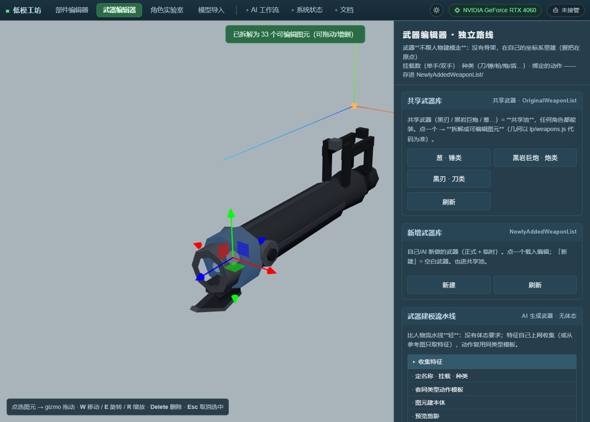
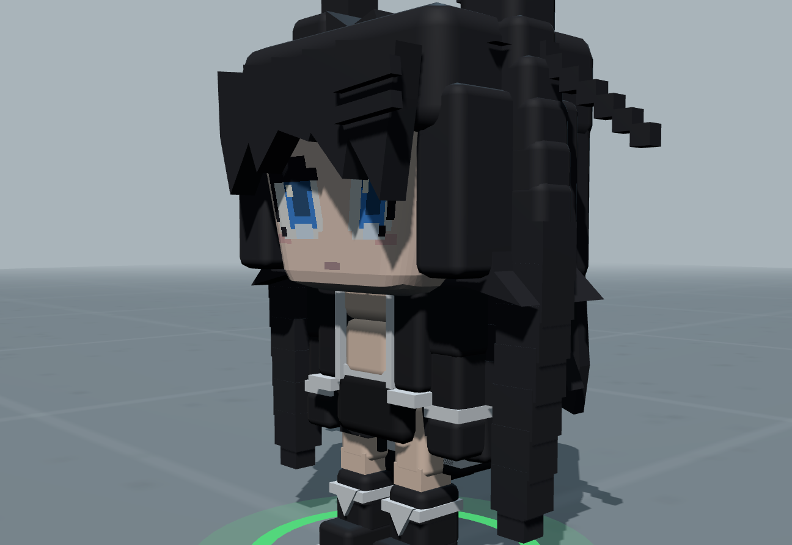

# 低模工坊 · Penguin Logistics Low-Poly Workshop

> 把《企鹅物流·未登记访客》的 three.js 低模管线**逐字拆出来**，做成一套本地工具：
> **拆分 · 程序化重建 · 调色 · 武器 · 导入** —— 并且**可以被 AI Agent 直接接管**。

**零依赖 · 零构建 · 纯离线**（Node 起一个静态服务就能跑，没有 npm、没有打包器、没有 CDN）


```
14 个原作低模（程序化重建，三角面逐人全等）  ·  2 个运行时角色（初音未来 / 黑岩射手）
4 个工具 + 8 个页面  ·  3 角色 × 2 个烘焙高模变体
108 条 EditorAPI 命令  ·  27 步生成流水线  ·  8 个质量门  ·  深浅两套主题
```

---

## ⚠️ 免责声明（先读这一段）

**这是一个非商业的学习 / 研究项目。**

- 本仓库里的 **`src/characters.orig.js` / `src/characters.face.js` / `src/characters.hires2.js`**
  / **`src/lowpoly/orig/*`**（14 个原作低模的程序化重建数据）/ `models/*.json`，以及预览截图，
  是**从《企鹅物流·未登记访客》的客户端 bundle 里提取 / 逐图元还原**出来的。
  它们的**著作权归原游戏开发方 / 发行方所有**，本仓库不做任何权利主张。
- 提取的唯一目的是**研究 low-poly 角色管线是怎么做的**（图元切分、骨架技巧、程序化重建、烘焙流程），
  以及把这些手法整理成可复用的工具与文档。
- **禁止用于任何商业用途。** 请勿用这些资源做二次发行、游戏解包合集、素材包之类的事。
- 如果你是权利人，**认为这里的内容侵犯了你的权益，请提一个 issue**，
  我会在第一时间删除对应文件（或整个仓库）。
- 你自己写的模型（`NewlyAddedModelList/`、`NewlyAddedWeaponList/` 里的）版权归你。

> 换句话说：**看可以、学可以、跑可以，别拿去卖，别当自己的作品发。**

---

## 这是什么

原作是个 three.js 写的低模角色系统。这个项目把它拆开、加上工具、再补上工程约束：

| | |
|---|---|
| **保真** | `boxify()` 按几何自带的 `primitiveVertexCounts` **精确**把原作模型切成可编辑图元 —— 不是包围盒近似。像素级 diff vs 原作 = **0.000%** |
| **程序化优先** | 角色 / 武器都用**代码 + 图元**建（`src/lowpoly/`）：14 个原作低模**三角面逐人全等**，初音 / 黑岩是纯代码角色；有参考图也只**取特征**，体态抄原版模型 |
| **一份模型代码，四个工具共用** | 唯一的真源是一份 `spec`（命名部件 + 四种图元），编辑器 / 实验室 / 武器编辑器 / 导入页都读它 |
| **能被 AI 驱动** | 所有能力都挂在 `window.EditorAPI` / `window.WeaponAPI`，配 27 步状态机 + 8 个质量门 + Agent 租约制；`systemPrompt()` 一键取最新提示词 |

### 四种图元

| kind | 是什么 | 用在哪 |
|---|---|---|
| `box` | 方块（圆角盒） | 手搓角色 / 武器的主力 |
| `panel` | 2D 多边形挤出 | 发片、衣片、刀身 |
| `op` | **原作几何的引用**（boxify 拆出来的） | 保真编辑原作 |
| `geo` | 球 / 柱 / 锥 / 环 / 胶囊 / 车削 / 挤出 | 程序化武器、导入平滑网格 |

---

## 截图

| 部件编辑器（逐图元编辑 + gizmo） | 角色实验室（高模 + 武器池） |
|---|---|
|  |  |
| **武器编辑器**（共享武器库 · 拆解 · 视口编辑） | **新增模型**（初音 / 黑岩等运行时角色） |
|  |  |

---

## 快速开始

**需要**：Node.js 16+ 、一个支持 WebGL 的现代浏览器（Chrome / Edge / Firefox）。

```bash
# ① 起服务（ES module 必须走 http，file:// 打不开）
node tools/_serve.js

# ② 打开
#    http://localhost:8765/
```

Windows 上双击 **`启动-低模工坊.bat`** 也一样（会顺手开浏览器）。

## 部署（Linux / 宝塔面板 / Docker）

零依赖、无构建，**装好 Node 就能跑**；前端 three.js 已本地化在 `vendor/three/`，**不依赖 CDN**。
完整步骤（宝塔 / PM2 / systemd / Docker + 安全清单 + 排错）见 [`docs/deploy.md`](docs/deploy.md)，速览：

```bash
# ① 传代码 + 权限
cd /www/wwwroot && git clone https://github.com/dxingkongzhixia/Low-Poly-Workshop.git lowpoly
chown -R www:www lowpoly

# ② 起服务（带鉴权；只绑本机，交给反代）
cd lowpoly && AUTH_USER=admin AUTH_PASS='换一个强密码' ./start.sh
#    或 PM2  ：AUTH_USER=admin AUTH_PASS='强密码' pm2 start ecosystem.config.js && pm2 save
#    或 Docker：AUTH_USER=admin AUTH_PASS='强密码' docker compose up -d --build

# ③ 反向代理 → http://127.0.0.1:8765（nginx / 宝塔「反向代理」）
#    ★ 记得加：  client_max_body_size 64m;   否则存模型报 413
# ④ 站点 SSL → Let's Encrypt；安全组只放行 80 / 443
```

**环境变量**（全部可选；模板见 [`.env.example`](.env.example)）

| 变量 | 默认 | 作用 |
|---|---|---|
| `PORT` | `8765` | 监听端口 |
| `HOST` | `127.0.0.1` | **默认只绑本机**（给反代用）；直连 / 局域网 / 容器映射用 `0.0.0.0` |
| `AUTH_USER` / `AUTH_PASS` | 空 | 整站 **Basic Auth** —— 给「人 / 浏览器」 |
| `API_READ_TOKEN` | 空 | `/api/*` 的**只读** token —— 给「只看模型」的 AI |
| `API_WRITE_TOKEN` | 空 | `/api/*` 的**读写** token —— 给要存 / 删的 AI |

> ⚠ **服务默认无鉴权、`/api/*` 可读可写。** 对外部署请至少开 Basic Auth；给 AI Agent **只发只读 token** 最安全。
> token 三种传法：`Authorization: Bearer <t>` / `X-API-Token: <t>` / GET 时 `?token=<t>`。
> ⚠ 配了 token 就**务必同时开 Basic Auth**，否则浏览器（没有 token）会调不动 `/api/*`。

> **为什么要起服务**：所有页面都是原生 ES module，浏览器不允许从 `file://` 加载；
> 而且保存模型 / 武器 / 临时缓存 / Agent 接管记录都走这个服务器的小 REST API。
> 服务端**只用 Node 内置模块**（`http` `fs` `path`），没有任何依赖。

---

## 四个工具

| 工具 | 干什么 |
|---|---|
| **部件编辑器**<br>`pages/character-editor.html` | 逐图元编辑（保留圆角 / 斜切 / 锯齿）· **基础 / 拆分源优先走程序化**（`PORTS → CHARACTERS → XT`，`id` 旁有「程序化 / 烘焙」标记）· **新增模型可直接编辑** · 分区规则 · 刀切平面 · 体素 / GLB 导入 · 暴露 `window.EditorAPI` + 生成流水线 + 质量门 |
| **角色实验室**<br>`pages/character-lab.html` | 14 个**程序化重建**的原作低模 + 烘焙高模 + **新增模型独立分区**（初音 / 黑岩）· 移动状态机 + 活动 · **武器池**（角色自带 / 共享池，互斥）· 调色板 · 截图 / JSON / GLB 导出 |
| **武器编辑器**<br>`pages/weapon-editor.html` | 武器**独立路线**（无骨架、握把在原点）· **共享武器库**（黑刃 / 黑岩巨炮 / 葱）一键**拆解成可编辑图元** · 视口 **gizmo 拖动 / 旋转 / 缩放 + 增删** · 模型代码视图 · **武器建模流水线** + 同类型动作模板 · 暴露 `window.WeaponAPI` |
| **模型导入**<br>`pages/model-import.html` | `.vox`(VoxelAI Studio / MagicaVoxel) / `.glb` / `.gltf` / `.obj` → 按连通分量拆成轴对齐盒 → 可编辑方块 |

外加三个信息页：**AI 工作流** / **系统状态** / **文档**（导航条右侧那一组，互相独立、不跳回启动页）。

---

## 程序化角色 / 武器（`src/lowpoly/`）

工坊最好的路线是**直接用代码写角色和武器**。运行时在这里：

| 文件 | 内容 |
|---|---|
| `src/lowpoly/model.js` | 骨架常量 + `Builder`（`box` / `shape` / `add` / `torus` / `addCyl`）+ 脸管线（`buildFace`） |
| `src/lowpoly/weapons.js` | 武器本体（`WEAPONS`）+ 挂载数（单手 / 双手）+ 种类（刀 / 锤 / 枪 / 炮 / 盾 / 杖 / 链 / 箱）+ `KIND_MOVES`（种类→动作模板） |
| `src/lowpoly/moves.js` | 武器动作（`ATTACKS` / `COMBOS`），纯姿态函数 |
| `src/lowpoly/rig.js` | 武器池绑定（`mountWeapons`）：两池互斥 / 2 手位 / 角色绑定 / 按序出招 |
| `src/lowpoly/character.js` | `Character` 抽象类 + `Miku` / `Brs` + `buildCharacter(id)` |
| `src/lowpoly/orig/*` | **14 个原作低模的程序化移植数据**（`*_DATA`）+ `buildFromPort()` |

**移植怎么做的**：钩 `Q.prototype.box/shape/add`（+ `Object3D.add`）跑一遍原作 `XT(id)`，抓下**作者级图元**与网格名，
再用我们自己的 `Builder` 重放 → 三角面**逐人全等**、逐骨骼 bbox 基本全对。
踩过的 9 个坑（只调一次 `XT` / `exact` 只给叶子 / 脸网格排除 / `geoRaw` 要 `toNonIndexed` /
`Builder` 不能混盒与裸几何 / 网格名回填 …）都写在 [`docs/lowpoly-runtime.md` §8.6](docs/lowpoly-runtime.md)。

**武器拆解**：`WeaponAPI.captureOriginal(id)` 钩 `Builder.box/shape/add` + `BufferGeometry.applyMatrix4`，
把共享武器还原成 `box / panel / geo`（黑刃 14 / 黑岩巨炮 33 / 葱 4 个图元，包围盒与原武器完全一致）。

---

## 让 AI 接管

这是这个项目比较特别的地方：**可以把整套工具交给一个 AI Agent 直接驱动。**

```js
// Agent 进场先登记（租约制，30 分钟没动静自动释放）
await EditorAPI.setAgent('claude-code', '按 ai-pipeline 跑「通用体型」的 hair 遍');

// 拿系统提示词（人物 / 武器各一份，永远最新）
EditorAPI.systemPrompt();          // → { prompt, version, docs }
WeaponAPI.systemPrompt();

// 每个回合的第一件事
EditorAPI.pipeline();        // ★ 权威：现在该干哪一步、下一句命令是什么

// 干完一遍：渲染 → 跑门 → 写评审
EditorAPI.render({ pass: true });
await EditorAPI.gates({ turntable: true });
EditorAPI.record('continue', { evidence: '对比图 + gate 报告', score: 0.85 });

// 收工必须交还
await EditorAPI.agentRelease('做完交还');
```

**规矩**（写死在文档里，Agent 必须遵守）：

- 27 步流水线：`准备 5 步 → blockout/structure/hair/detail/color 五遍 × 每遍 4 步 → 收尾 2 步`
- 评审只有 5 个合法动作：`continue` / `refine-spec` / `refine-code` / `request-input` / `stop`
- 同一遍最多修正 3 次、总计 6 次 → 到顶 `status='stopped'`（**硬停**，不许自己 reset）
- **8 个质量门**：轮廓 IoU（224²，分遍 0.60→0.85）· 转盘 · 内外差 · 左右镜像 · 接缝 · 净空 · 头皮覆盖 · 穿插
- 「没测」≠「通过」：任何门 `unevaluated`，总判定就是 `unevaluated`
- **★ 人物生成「程序化优先」**：① 优先用代码建完整可动角色 ② **体态抄原版模型**（不取参考图的体态）
  ③ **特征让 AI 自己上网收集**（不要求用户给图）④ 有图**只参考图上的特征**

一张图看懂主流程 + 7 个分支：[`docs/ai-pipeline-overview.md`](docs/ai-pipeline-overview.md)（[`.mmd`](docs/ai-pipeline-overview.mmd) 同源）。

**AI 也能直接拿模型文件**（纯 HTTP 就够，不需要浏览器）：

```bash
curl http://localhost:8765/api/index                  # 这里有什么、从哪拿
curl http://localhost:8765/api/characters             # 原作角色索引（低模 14 + 高模变体）
curl http://localhost:8765/api/original-weapons        # 共享武器库
curl http://localhost:8765/api/models/<id>/bundle     # ★ 一次拿全：spec + model.js + 直链
curl http://localhost:8765/api/weapons/<id>/bundle
```

详见 [`docs/model-files.md`](docs/model-files.md)、[`docs/weapon-files.md`](docs/weapon-files.md)、[`docs/ai-workflow.md`](docs/ai-workflow.md)。

---

## 技术要点（几个我觉得有意思的地方）

- **`boxify()` 的精确切分** —— 直接读 `geometry.userData.primitiveVertexCounts`，
  按图元边界切成独立几何，保留圆角 / 斜切 / 锯齿；验收标准是**像素级 diff = 0.000%**。
  我们自己的 `Builder.build()` 现在也写这张表 → 程序化角色 / 武器同样能精确拆解。
- **程序化移植 / 拆解** —— 两处都靠**钩住作者级图元**（不是几何启发式）。
  ⚠ 拆武器时**只能钩 `BufferGeometry.applyMatrix4`**：three 的 `translate/rotateX/Y/Z/scale` 内部都走它，
  同时钩会把同一变换记两遍（位移 / 旋转翻倍）。
- **两套脸管线** —— 原作 14 人用**手绘脸表**（`attachFace`，96×80 逐像素）；
  运行时角色用**贴图脸**（`buildFace`，睁 / 闭眼 + 严肃变体）。转成可编辑时按来源分别重建。
- **骨架用「组级 TRS」** —— `rig.groups` 里每个组带完整的位置 / 旋转 / 缩放，旧版扁平字段仍兼容
  （两套表示同时存在，写的时候要一起写 —— 这个坑踩过）。
- **质量门全是纯函数** —— 吃 canvas / 几何，吐 `{verdict, score, detail}`，不碰 DOM 全局；
  `src/pipeline.js` 也没有 DOM 依赖。
- **配色全是 CSS 变量** —— 语义变量 × 深浅两套，页面里**一个 `#hex` 都不许有**（selfcheck 会查）。
- **零依赖零构建** —— 没有 `package.json`、没有 `node_modules`、没有打包步骤；
  服务端只用 `http` / `fs` / `path`。

---

## 目录

```
低模工坊/
├─ README.md                   本文件
├─ CHANGELOG.md                ★ 变更记录：每次会话改了什么 / 为什么 / 怎么验证
├─ 低模工坊-制作流程笔记.md      ★ 踩坑笔记 + 建模顺序规程（人和 AI 都该先看）
├─ 启动-低模工坊.bat             双击起服务 + 开浏览器
│
├─ pages/                      8 个页面（入口 + 4 工具 + 3 信息页）
│   ├─ index.html                启动页
│   ├─ character-editor.html     ★ 部件编辑器 + EditorAPI（单文件）
│   ├─ character-lab.html        角色实验室
│   ├─ weapon-editor.html        武器编辑器 + WeaponAPI（单文件）
│   ├─ model-import.html         模型导入
│   └─ ai-workflow.html / system.html / docs.html   信息页
│
├─ src/                        共享 JS
│   ├─ lowpoly/                  ★ 程序化角色运行时（见上）
│   │   ├─ model.js / weapons.js / moves.js / rig.js / character.js / export.js
│   │   └─ orig/                 14 个原作低模的移植数据 + port.js
│   ├─ characters.lowpoly.js     运行时入口（barrel）
│   ├─ characters.orig.js        原作低模生成器 XT(id)          ← 提取自游戏
│   ├─ characters.face.js        原作头脸贴图管线               ← 提取自游戏
│   ├─ characters.hires2.js      原作烘焙高模 $O(id,variant)    ← 提取自游戏
│   ├─ characters.store.js       浏览器侧：保存 / 缓存 / Agent 租约 / 显卡
│   ├─ pipeline.js              27 步流水线状态机 + 质量契约
│   ├─ quality-gates.js          8 个质量门（纯函数）
│   ├─ vox-import.js             .vox / .glb / .obj → 方块
│   ├─ model-readout.js          ★ AI 读数通道：dump / ascii / refProfile
│   ├─ shell.js                  统一导航条 + 主题（深浅两套）
│   └─ docs-viewer.js            自写 Markdown 渲染（无 CDN）
│
├─ styles/                     shell.css（语义变量 × 深浅两套）
├─ tools/                      _serve.js（本地服务器 + REST API） / selfcheck.js（自检）
│
├─ docs/                       ★ 12 篇文档 + 1 张流水线图源（原始 Markdown，人和 AI 共用）
├─ data/                       原作实测数据 + 角色索引
├─ models/                     烘焙高模数据                  ← 提取自游戏
├─ images/                     预览图 / AI 卡片图 / 参考图
├─ refs/                       外部参考素材
├─ skills/                     第三方技能（未改动）
├─ OriginalWeaponList/         ★ 共享武器库（= 共享池本体；几何以代码为准）
├─ NewlyAddedModelList/        ★ 你做的模型（正式）
├─ NewlyAddedModelTemporaryList/  待确认的
├─ NewlyAddedWeaponList/       ★ 你做的武器（正式）
├─ NewlyAddedWeaponTemporaryList/ 待确认的
└─ TemporaryCache/
    ├─ refs/                   ★ 参照图（服务端资产，清缓存即清）
    └─ …                       AI 测试产物 + agent.json
```

> **归类约定（2026-09）**：`.html` 一律进 `pages/`，共享 `.js` 进 `src/`，`.css` 进 `styles/`，
> 工具脚本进 `tools/`。**旧路径由 `_serve.js` 302 跳到新位置**，书签和外部链接不会断。
>
> **两条命令**（都支持在任意目录下执行）：
> ```bash
> node tools/_serve.js        # 起服务（★必须先跑）
> node tools/selfcheck.js     # 自检
> ```

---

## 文档

**人看**：起服务后打开 <a href="http://localhost:8765/docs.html">`pages/docs.html`</a>（左边选文件、右边渲染好的正文，能一键切原始 `.md`）。
**AI 读**：直接 `fetch('/docs/xx.md')` —— 原始 Markdown，一个字没改，没有任何 HTML 包装。

| 文档 | 给谁 | 内容 |
|---|---|---|
| [`README.md`](docs/README.md) | 人 + AI | 索引、按症状查、文件地图 |
| [`ai-pipeline.md`](docs/ai-pipeline.md) | AI | 27 步流水线、8 个门的阈值、反模式、**§〇·B 建模顺序规程**、§十一 程序化角色 |
| [`ai-pipeline-overview.md`](docs/ai-pipeline-overview.md) | 人 + AI | ★ **一张图看懂主流程 + 7 个分支**（`.mmd` 同源）+ 分支速查表 |
| [`ai-workflow.md`](docs/ai-workflow.md) | AI + 用户 | 怎么接管、接口边界、租约制、交还规矩 |
| [`model-files.md`](docs/model-files.md) | AI | ★ 怎么直接拿到模型文件 |
| [`weapon-files.md`](docs/weapon-files.md) | AI + 人 | ★ 武器文件 / 三个目录 / **武器建模流水线** / `WeaponAPI` |
| [`lowpoly-runtime.md`](docs/lowpoly-runtime.md) | AI + 人 | ★ **程序化角色运行时** + 14 人移植方法（含 §8.6 的 9 个坑）/ 武器池 / 生成策略 |
| [`editor-api.md`](docs/editor-api.md) | 人 + AI | 命令速查、规格结构、四种图元 |
| [`storage.md`](docs/storage.md) | 人 + AI | 目录分工、REST API、数据格式 |
| [`gpu.md`](docs/gpu.md) | 用户 | 显卡检测、**没有显卡怎么办** |
| [`deploy.md`](docs/deploy.md) | 运维 | ★ 部署到服务器：宝塔 / PM2 / systemd / Docker、环境变量、反向代理、安全清单 |
| [`troubleshooting.md`](docs/troubleshooting.md) | 人 + AI | 按症状排查（含踩过的坑） |
| [`development.md`](docs/development.md) | 改代码的人 | ★ 架构分层、模块参考、**关键不变量** |

### 自检

```bash
node tools/_serve.js        # 一个窗口
node tools/selfcheck.js     # 另一个窗口
```

查引用完整性、页面外壳、**文档 vs 命令双向核对**、主题卫生（有没有写死颜色）、服务端端点冒烟。

### 发布到 GitHub

```bash
git add -A
git commit -m "改了什么"
git push
```

> 如果 `git push` 报 `Connection was reset` / `Failed to connect`：多半是**系统代理没被 git 读到**
> （git 的 libcurl 不读 Windows 的 WinINET 代理）。查系统代理后给本仓库配上即可：
> ```bash
> git config --local http.proxy  http://127.0.0.1:<端口>
> git config --local https.proxy http://127.0.0.1:<端口>
> ```

---

## 已知限制

- **需要一个有显卡的本机浏览器。** 虚拟机 / 远程桌面 / 无头环境里通常是软件渲染（SwiftShader），
  能跑但很慢，导出 GLB 容易崩。见 [`docs/gpu.md`](docs/gpu.md)。
- **程序化移植数据偏大** —— 用了「精确几何」的几位 6KB ~ 710KB/人。
  可选的「忠实树」压缩模式（`port.js` 模式 A）已支持但**本轮未启用**。
- **武器拆解对认不出的几何会略过** —— 目前能还原 `Box/Cylinder/Sphere/Cone/Torus/Ring` 六种；
  其它自定义几何不会被收进图元（不影响只读预览）。
- **`variantSpec()` 只能用在 box/geo 图元的规格上**（比如「通用体型」预设）。
  对 `boxify()` 出来的 `op` 图元算不出躯干顶 / 脚底，只会挪骨架、不缩放几何（会返回一条 `warn`）。
- **低模和高模混搭比例会不一致**（两套骨架），编辑器里会提示。
- **bundle 提取靠人工对读**，`characters.*.js` 里的名字是压缩后的（`XT` / `Q` / `KT` …），
  没做 demangle，读起来确实痛苦。

---

## 致谢

- 原作 **《企鹅物流·未登记访客》** 及其开发
- 本服务全程由 [opencode](https://opencode.ai) 开发，所有代码逻辑全部为 **AI** 编写，
  作者只提供参考考据、服务流程与方法论
- **three.js** —— 整套工具跑在它上面（通过 importmap，无打包）
- **img2threejs** 技能 —— 本项目沿用了它的「先度量、后建模、质量门卡关」的方法论

---

<div align="center">

**本仓库仅供学习研究，禁止商用。** 侵权请联系，即删。

</div>
