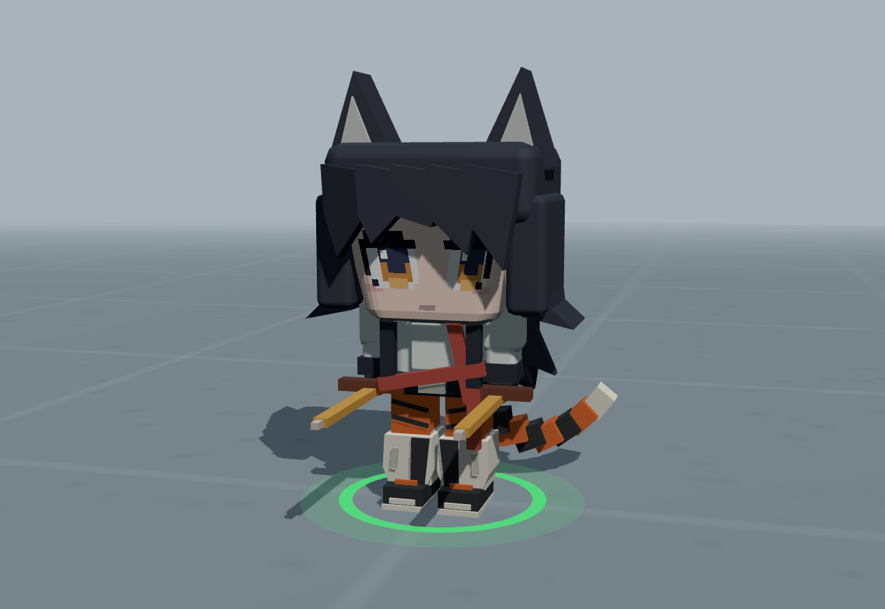

# 低模工坊 · Penguin Logistics Low-Poly Workshop

> 把《企鹅物流·未登记访客》的 three.js 低模管线**逐字拆出来**，做成一套本地工具：
> **拆分 · 调色 · 混搭 · 导入** —— 并且**可以被 AI Agent 直接接管**。

**零依赖 · 零构建 · 纯离线**（Node 起一个静态服务就能跑，没有 npm、没有打包器、没有 CDN）

```
14 个原作低模   ·   6 个烘焙高模   ·   116 个 EditorAPI 命令
27 步生成流水线  ·   8 个质量门     ·   深浅两套主题
```

---

## ⚠️ 免责声明（先读这一段）

**这是一个非商业的学习 / 研究项目。**

- 本仓库里的 **`src/characters.orig.js` / `src/characters.face.js` / `src/characters.hires2.js` / `models/*.json`**
  以及预览截图，是**从《企鹅物流·未登记访客》的客户端 bundle 里逐字提取**出来的。
  它们的**著作权归原游戏开发方 / 发行方所有**，本仓库不做任何权利主张。
- 提取的唯一目的是**研究 low-poly 角色管线是怎么做的**（图元切分、骨架技巧、烘焙流程），
  以及把这些手法整理成可复用的工具与文档。
- **禁止用于任何商业用途。** 请勿用这些资源做二次发行、游戏解包合集、素材包之类的事。
- 如果你是权利人，**认为这里的内容侵犯了你的权益，请提一个 issue 或发邮件**，
  我会在第一时间删除对应文件（或整个仓库）。
- 你自己写的模型（`NewlyAddedModelList/` 里的）版权归你。

> 换句话说：**看可以、学可以、跑可以，别拿去卖，别当自己的作品发。**

---

## 这是什么

原作是个 three.js 写的低模角色系统。这个项目把它拆开、加上工具、再补上工程约束：

| | |
|---|---|
| **保真** | `boxify()` 按几何自带的 `primitiveVertexCounts` **精确**把原作模型切成可编辑图元 —— 不是包围盒近似。像素级 diff vs 原作 = **0.000%** |
| **一份模型代码，四个工具共用** | 唯一的真源是一份 `spec`（命名部件 + 四种图元），编辑器 / 实验室 / 武器编辑器 / 导入页都读它 |
| **能被 AI 驱动** | 所有能力都挂在 `window.EditorAPI`（116 个命令），配 27 步状态机 + 8 个质量门 + Agent 租约制 |

### 四种图元

| kind | 是什么 | 用在哪 |
|---|---|---|
| `box` | 方块 | 手搓角色的主力 |
| `panel` | 2D 多边形挤出 | 发片、衣片 |
| `op` | **原作几何的引用**（boxify 拆出来的） | 保真编辑原作 |
| `geo` | 球 / 柱 / 锥 / 胶囊 / 环 / 车削 / 挤出 | 导入平滑网格后 |

---

## 截图

| 部件编辑器 | 角色实验室 |
|---|---|
|  |  |
| **武器编辑器**（跨角色槽位混搭） | **新增模型**（自己做的角色） |
|  |  |

---

## 快速开始

**需要**：Node.js 16+ 、一个支持 WebGL 的现代浏览器（Chrome / Edge / Firefox）。

```bash
# ① 起服务（ES module 必须走 http，file:// 打不开）
node tools/_serve.js

# ② 打开
#    http://localhost:8765/
```

Windows 上双击 **`启动-低模工坊.bat`** 也一样（会顺手开浏览器）。

> **为什么要起服务**：所有页面都是原生 ES module，浏览器不允许从 `file://` 加载；
> 而且保存模型 / 临时缓存 / Agent 接管记录都走这个服务器的小 REST API。
> 服务端**只用 Node 内置模块**（`http` `fs` `path`），没有任何依赖。

---

## 四个工具

| 工具 | 干什么 |
|---|---|
| **部件编辑器**<br>`pages/character-editor.html` | 逐图元编辑（保留圆角/斜切/锯齿）· 分区规则 · 刀切平面 · 体素/GLB 导入 · 暴露 `window.EditorAPI` + 生成流水线 + 质量门 |
| **角色实验室**<br>`pages/character-lab.html` | 14 个原作低模 + 6 个烘焙高模 + **新增模型独立分区** · 动画 · 调色板 · 截图 / JSON / GLB 导出 |
| **武器编辑器**<br>`pages/weapon-editor.html` | 按槽位（头/脸·头发·左臂·右臂·左腿·右腿·后摆·兽尾·光环·道具）把不同角色的部件互换 |
| **模型导入**<br>`pages/model-import.html` | `.vox`(VoxelAI Studio / MagicaVoxel) / `.glb` / `.gltf` / `.obj` → 按连通分量拆成轴对齐盒 → 可编辑方块 |

外加三个信息页：**AI 工作流** / **系统状态** / **文档**（导航条右侧那一组，互相独立、不跳回启动页）。

---

## 让 AI 接管

这是这个项目比较特别的地方：**可以把整套工具交给一个 AI Agent 直接驱动。**

```js
// Agent 进场先登记（租约制，30 分钟没动静自动释放）
await EditorAPI.setAgent('claude-code', '按 ai-pipeline 跑「通用体型」的 hair 遍');

// 每个回合的第一件事
EditorAPI.pipeline();        // ★ 权威：现在该干哪一步、下一句命令是什么

// 干完一遍：渲染 → 跑门 → 写评审
EditorAPI.render({ pass: true });
await EditorAPI.gates({ turntable: true });
EditorAPI.record('continue', { evidence: '对比图 + gate 报告', score: 0.85 });

// 收工必须交还
await EditorAPI.agentRelease('做完交还');
```

**规矩**（写死在文档里，Agent 必须遵守）：

- 27 步流水线：`准备 5 步 → blockout/structure/hair/detail/color 五遍 × 每遍 4 步 → 收尾 2 步`
- 评审只有 5 个合法动作：`continue` / `refine-spec` / `refine-code` / `request-input` / `stop`
- 同一遍最多修正 3 次、总计 6 次 → 到顶 `status='stopped'`（**硬停**，不许自己 reset）
- **8 个质量门**：轮廓 IoU（224²，分遍 0.60→0.85）· 转盘 · 内外差 · 左右镜像 · 接缝 · 净空 · 头皮覆盖 · 穿插
- 「没测」≠「通过」：任何门 `unevaluated`，总判定就是 `unevaluated`

**AI 也能直接拿模型文件**（纯 HTTP 就够，不需要浏览器）：

```bash
curl http://localhost:8765/api/index                  # 这里有什么、从哪拿
curl http://localhost:8765/api/characters             # 原作角色索引（低模 14 + 高模变体）
curl http://localhost:8765/api/models/<id>/bundle     # ★ 一次拿全：spec + model.js + 直链
curl http://localhost:8765/api/models/<id>/file/model.js
```

详见 [`docs/model-files.md`](docs/model-files.md)、[`docs/ai-workflow.md`](docs/ai-workflow.md)。

---

## 技术要点（几个我觉得有意思的地方）

- **`boxify()` 的精确切分** —— 直接读 `geometry.userData.primitiveVertexCounts`，
  按图元边界切成独立几何，保留圆角/斜切/锯齿；每个图元的形心当它在部件里的坐标。
  验收标准是**像素级 diff = 0.000%**。
- **骨架用「组级 TRS」** —— `rig.groups` 里每个组带完整的位置/旋转/缩放，
  这样能表达原作小腿那种 `scale: [1, 0.85, 1]`；旧版扁平字段仍然兼容。
  （`spec.rig` 里两套表示**同时存在**，写的时候必须两边一起写 —— 这个坑踩过，写在文档里了。）
- **质量门全是纯函数** —— 吃 canvas / 几何，吐 `{verdict, score, detail}`，不碰 DOM 全局。
  `src/pipeline.js` 也没有 DOM 依赖，可以单独 require。
- **配色全是 CSS 变量** —— 45 个语义变量 × 深浅两套，页面里**一个 `#hex` 都不许有**
  （包括 JS 拼的内联样式和 canvas 2D 绘图色）。
- **零依赖零构建** —— 没有 `package.json`、没有 `node_modules`、没有打包步骤。
  服务端 450 行、只用 `http`/`fs`/`path`。

---

## 目录

```
低模工坊/
├─ README.md                   本文件
├─ CHANGELOG.md                ★ 变更记录：每次会话改了什么 / 为什么 / 怎么验证
├─ 低模工坊-制作流程笔记.md      ★ 踩坑笔记 + 建模顺序规程（人和 AI 都该先看）
├─ 启动-低模工坊.bat             双击起服务 + 开浏览器
├─ 发布到GitHub.bat
│
├─ pages/                      8 个页面（入口 + 4 工具 + 3 信息页）
│   ├─ index.html                启动页
│   ├─ character-editor.html     ★ 部件编辑器 + EditorAPI（116 命令，单文件）
│   ├─ character-lab.html        角色实验室
│   ├─ weapon-editor.html      武器编辑器
│   ├─ model-import.html         模型导入
│   └─ ai-workflow.html / system.html / docs.html   信息页
│
├─ src/                        共享 JS
│   ├─ characters.orig.js        原作低模生成器 XT(id)          ← 提取自游戏
│   ├─ characters.face.js        原作头脸贴图管线               ← 提取自游戏
│   ├─ characters.hires2.js      原作烘焙高模 $O(id,variant)    ← 提取自游戏
│   ├─ characters.store.js       浏览器侧：保存 / 缓存 / Agent 租约 / 显卡
│   ├─ pipeline.js               27 步流水线状态机 + 质量契约
│   ├─ quality-gates.js          8 个质量门（纯函数）
│   ├─ vox-import.js             .vox / .glb / .obj → 方块
│   ├─ model-readout.js          ★ AI 读数通道：dump / ascii / refProfile
│   ├─ shell.js                  统一导航条 + 主题（深浅两套）
│   └─ docs-viewer.js            自写 Markdown 渲染（无 CDN）
│
├─ styles/                     shell.css（45 个语义变量 × 深浅两套） / model-import.css
├─ tools/                      _serve.js（本地服务器 + REST API） / selfcheck.js（自检）
│
├─ docs/                       9 篇文档（原始 Markdown，人和 AI 共用）
├─ data/                       原作实测数据 + 角色索引
├─ models/                     烘焙高模数据                  ← 提取自游戏
├─ images/                     预览图 / AI 卡片图 / 参考图
├─ refs/                       外部参考素材（img2threejs 工作目录）
├─ skills/                     第三方技能（未改动）
├─ NewlyAddedModelList/        ★ 你做的模型（正式）
├─ NewlyAddedModelTemporaryList/  待确认的
└─ TemporaryCache/
    ├─ refs/                   ★ 参照图（服务端资产，清缓存即清）
    └─ …                       AI 测试产物 + agent.json
```

> **归类约定（2026-09）**：`.html` 一律进 `pages/`，共享 `.js` 进 `src/`，`.css` 进 `styles/`，
> 工具脚本进 `tools/`。**旧路径（`/character-editor.html` 等）由 `_serve.js` 302 跳到新位置**，
> 书签和外部链接不会断。
>
> **两条命令**（都支持在任意目录下执行）：
> ```bash
> node tools/_serve.js        # 起服务（★必须先跑）
> node tools/selfcheck.js     # 自检
> ```

---

## 文档

**人看**：起服务后打开 <a href="http://localhost:8765/docs.html">`pages/docs.html`</a>（左边选文件、右边渲染好的正文，能一键切原始 `.md`）。
**AI 读**：直接 `fetch('/docs/xx.md')` —— 原始 Markdown，一个字没改，没有任何 HTML 包装。

| 文档 | 给谁 | 内容 |
|---|---|---|
| [`README.md`](docs/README.md) | 人 + AI | 索引、按症状查、文件地图、五条铁律 |
| [`ai-workflow.md`](docs/ai-workflow.md) | AI + 用户 | 怎么接管、接口边界、租约制、交还规矩 |
| [`ai-pipeline.md`](docs/ai-pipeline.md) | AI | 27 步流水线、8 个门的阈值、反模式 |
| [`model-files.md`](docs/model-files.md) | AI | ★ 怎么直接拿到模型文件 |
| [`editor-api.md`](docs/editor-api.md) | 人 + AI | 116 个命令速查、规格结构、四种图元 |
| [`storage.md`](docs/storage.md) | 人 + AI | 三个目录的分工、REST API、数据格式 |
| [`gpu.md`](docs/gpu.md) | 用户 | 显卡检测、**没有显卡怎么办** |
| [`troubleshooting.md`](docs/troubleshooting.md) | 人 + AI | 按症状排查（含踩过的坑） |
| [`development.md`](docs/development.md) | 改代码的人 | ★ 架构分层、模块参考、**关键不变量** |

### 自检

```bash
node tools/_serve.js        # 一个窗口
node tools/selfcheck.js     # 另一个窗口
```

查引用完整性、页面外壳、**文档 vs 116 个命令双向核对**、主题卫生（有没有写死颜色）、服务端端点冒烟。

### 发布到 GitHub

仓库根目录有个 **`发布到GitHub.bat`**，双击就能把当前状态提交并推上去：

```
自动检查 git / gh 是否安装 → 没初始化就 init → 有改动就提交
→ 没登录就弹浏览器授权 → 没远程就建仓库 + 推送
```

不想用脚本的话，普通流程就是：

```bash
git add -A
git commit -m "改了什么"
git push
```

---

## 已知限制

- **需要一个有显卡的本机浏览器。** 虚拟机 / 远程桌面 / 无头环境里通常是软件渲染（SwiftShader），
  能跑但很慢，导出 GLB 容易崩。见 [`docs/gpu.md`](docs/gpu.md)。
- **原作低模没有网格文件** —— 它是 `XT(id)` 现场算出来的。`boxify()` 之后才能拿到可编辑的图元。
- **`variantSpec()` 只能用在 box/geo 图元的规格上**（比如「通用体型」预设）。
  对 `boxify()` 出来的 `op` 图元算不出躯干顶/脚底，只会挪骨架、不缩放几何（会返回一条 `warn`）。
- **低模和高模混搭比例会不一致**（两套骨架），武器编辑器里会提示。
- **bundle 提取靠人工对读**，`characters.*.js` 里的名字是压缩后的（`XT` / `Q` / `KT` …），
  没做 demangle，读起来确实痛苦。

---

## 致谢

- 原作 **《企鹅物流·未登记访客》** 及其开发
- 本服务全程由opencode开发，所有代码逻辑全部为al编写，本人只提供参考考据，服务流程，方法论
- **three.js** —— 整套工具跑在它上面（通过 importmap，无打包）
- **img2threejs** 技能 —— 本项目沿用了它的「先度量、后建模、质量门卡关」的方法论
  （以及 `object-sculpt-spec.json` 的导入支持）

---

<div align="center">

**本仓库仅供学习研究，禁止商用。** 侵权请联系，即删。

</div>
