# AI 流水线 · 分支总览

> 一张图说清「AI 生成低模」的主流程与所有分支。
> 同图源文件：[`ai-pipeline-overview.mmd`](ai-pipeline-overview.mmd)；
> 细则见 [`ai-pipeline.md`](ai-pipeline.md) 与 [`ai-workflow.md`](ai-workflow.md)。

**★ 人物生成策略（程序化优先）**：① 优先程序化（代码 + 图元 + 特征清单）；
② **体态抄原版模型**（§11.1 常量 / `boxify` 去量），不取参考图的体态；
③ **特征让 AI 自己上网收集**，不要求用户给图；④ 有图**只参考图上的特征**，别做逐像素对剪影。

```mermaid
flowchart TD
  U(["用户 ↔ AI 对话<br/>AI 调 window.EditorAPI"]) --> P["每个回合第一句：<br/>EditorAPI.pipeline()"]
  P --> Q{"status == stopped ?"}
  Q -->|"是"| HARD["硬停 · 报告 stopReason<br/>不许继续 · 不许自己 reset"]
  Q -->|"否"| M

  subgraph M["接管方式 · 分支 1"]
    M1["A 只读建议<br/>只读 state / tree / describe"]
    M2["B Agent 驱动 · 推荐<br/>直接执行 JS + 租约登记"]
    M3["C 脚本批处理<br/>产出 JS 粘贴 / 动态 import"]
  end
  M --> CR

  subgraph CR["创建路线 · 分支 2"]
    CR1["改造原作角色<br/>boxify id → kind op"]
    CR2["从零做新角色<br/>addPart + addPrimitive / buildPart recipe"]
    CR3["程序化角色<br/>src/lowpoly · 不吃参照图"]
  end
  CR --> S

  subgraph S["基础 / 拆分源 · 分支 3"]
    S1["LP.PORTS → buildFromPort · 程序化"]
    S2["LP.CHARACTERS → buildCharacter proto · 程序化新增"]
    S3["否则 → XT id · 烘焙"]
    S4["新增模型 spec → loadStoredModel id"]
  end
  S --> I

  subgraph I["输入 · 分支 4（程序化优先）"]
    I1["默认 · AI 自己上网收集特征 → 特征清单"]
    I2["有图 · reference → admit 判定<br/>多视图拼版 → refCrop 切单视图"]
    I3["图不可用 → 换图 · 或只跑不吃图的门"]
    I4["体态一律抄原版模型 · 图只取特征"]
  end
  I --> SET["准备 5 步<br/>reference → admit → palette → complexity → contract"]
  SET --> CX{"复杂度 · 分支 5<br/>simple / moderate / complex / ultra-complex"}
  CX --> P1

  P1["blockout · IoU 0.60"] --> P2["structure · 0.72"] --> P3["hair · 0.78"] --> P4["detail · 0.80"] --> P5["color · 0.85"]
  P5 --> STEP["每一遍固定 4 步<br/>build → render → gate → review"]
  STEP --> G{"8 门三态 · 分支 6<br/>silhouette turntable interior chirality<br/>seam clearance scalp penetration"}
  G --> R{"record action · 分支 7"}
  R -->|"continue · evidence + score ≥ 0.7"| NX["换下一遍"]
  R -->|"refine-spec · 规格错 / 浅"| LP["计一次循环 · 重置本遍"]
  R -->|"refine-code · 实现不对"| LP
  R -->|"request-input / stop"| HARD
  LP --> LIM{"同一遍 ≥ 3 或 总计 ≥ 6 ?"}
  LIM -->|"是"| HARD
  LIM -->|"否"| STEP
  NX --> D{"五遍走完 ?"}
  D -->|"否"| STEP
  D -->|"是"| F["收尾 2 步<br/>turntable → export"]
  F --> SV["saveModel → NewlyAddedModelList"]
```

## 分支速查

| # | 分支 | 选项 | 判定点 |
|---|---|---|---|
| 1 | 接管方式 | A 只读建议 · B Agent 驱动（推荐）· C 脚本批处理 | 人怎么让 AI 干活 |
| 2 | 创建路线 | 改造原作 · 从零做 · 程序化角色 | `ai-pipeline.md` §6.1 |
| 3 | 基础 / 拆分源 | PORTS · CHARACTERS · 回退 XT · 新增模型 spec | `getBase(id)` |
| 4 | 输入 | **默认：AI 自己上网收集特征** · 有图：admit 判定 / 拼版裁切 / 图不可用 | `admit()` |
| 5 | 复杂度 | simple / moderate / complex / ultra-complex | `COMPLEXITY_MINIMUMS` |
| 6 | 门三态 | pass / fail / **unevaluated** | `summary.verdict` |
| 7 | 评审动作 | continue / refine-spec / refine-code / request-input / stop | `record()` |

**两条硬约束**：`refine-*` 同一遍 ≥3 或总计 ≥6 → **硬停**；任一门 `unevaluated` → 结论 `unevaluated`（「没测」≠「通过」）。
